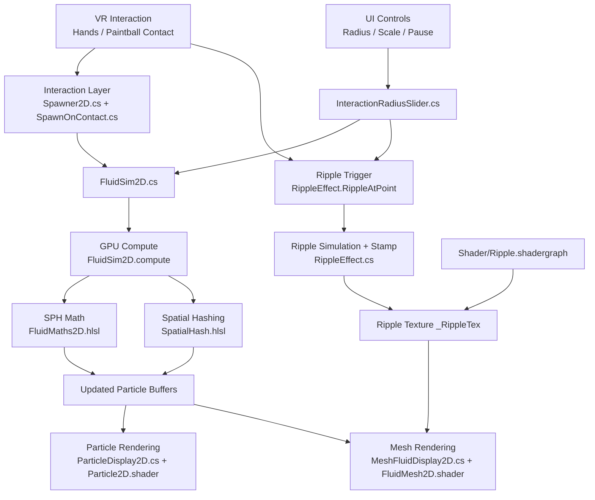

[](https://classroom.github.com/a/B06_mcpV)

# Table of Contents
- [Project Overview](#project-overview)
- [Demo](#demo)
- [Background](#background)
- [Core Features](#core-features)
- [System Architecture](#system-architecture)
- [Fluid Simulation](#fluid-simulation)
- [Visual Effects](#visual-effects)
- [Optimisations](#optimisations)
- [User Interface](#user-interface)
- [Known Limitations](#known-limitations)
- [Setup](#setup)
- [References](#references)

# Project Overview

This project is intended for the development of a virtual reality application for Tai Chi. This is a modular component of a broader system where it mimics the Chinese Lacquer Fan painting technique:

<p align="center">
  <table width="66%">
    <tr>
      <td width="50%" align="center">
        <a href="https://youtube.com/shorts/lEORvgufwKo">
          
        </a>
      </td>
      <td width="50%" align="center">
        <a href="https://youtube.com/shorts/PvedcEcfpY0">
          
        </a>
      </td>
    </tr>
  </table>
</p>

<!-- PUT SOME IMAGES OF CHINESE LACQUER FAN PAINTING AND REFERENCE THEM  -->

The intent of this program is to manipulate dynamic water surfaces and oil paint using intuitive VR hand tracking interactions, being optimised for usage on the Meta Quest 2. This project prioritises realistic fluid mechanics and high performance which can also be adjusted in user settings within the simulation.

# Demo

The first demo shows in-headset gameplay, including live interaction with the canvas and real-time settings adjustments.
<p align="center">
  <a href="https://raw.githubusercontent.com/COMP2281/software-engineering-group25-26-11/main/UserDemo.mp4">
    
  </a>
</p>

The second demo highlights the fluid display and colour blending behaviour across mixed paint interactions with the added ripple effects.

<p align="center">
  <a href="https://raw.githubusercontent.com/COMP2281/software-engineering-group25-26-11/main/FluidDisplay.mp4">
    
  </a>
</p>

The image below shows the simulation layout, including the navigation bar, paintball spawn area, and interactive screen.

<p align="center">
  
</p>

# Background
This project builds on Sebastian Lague's fluid simulation system from *Coding Adventure: Simulating Fluids* (YouTube: https://youtu.be/rSKMYc1CQHE), then adapts it for an interactive VR painting workflow.

Sebastian's base system models fluid with **Smoothed-Particle Hydrodynamics (SPH)**, where each fluid element is a moving particle. Our modified version keeps this principle but tailors it to this project: GPU compute-based updates for high particle counts, parameter controls for paint speed/fluidity/sensitivity, dynamic screen resizing, and integration with VR paintball interactions. Sebastian's system provides the physically inspired SPH core, while this project extends it into a responsive lacquer fan painting simulation.

<p align="center">
  <a href="https://youtu.be/rSKMYc1CQHE">
    
  </a>
</p>


# Core Features

- **Dynamic water screen**
    - Water surface can be adjusted to user-preferred sizes
    - Fluid bounds and visual surface interact during screen resizing
    - Colours for paint can be adjusted during runtime
    - Ripple responses are retained across interaction updates

<p align="center">
  <a href="https://raw.githubusercontent.com/COMP2281/software-engineering-group25-26-11/main/ScreenResize.mp4">
    
  </a>
</p>

- **Colour selection**
    - Similar to Microsoft Paint's interface
  - Can choose and update the colour of paintballs
  - Multiple interfaces for colour selection
  - Colour wheel, RGB slider menu and HexPad input are provided
  - Colour previews and values stay synchronized across all input methods
  - Can adjust throughout the simulation


<p align="center">
  <table width="66%">
    <tr>
      <td width="50%" align="center">
        
      </td>
      <td width="50%" align="center">
        
      </td>
    </tr>
    <tr>
      <td width="50%" align="center">
        
      </td>
      <td width="50%" align="center">
        
      </td>
    </tr>
  </table>
</p>

- **Navigation bar**
    - Similar to Meta Headset navigation bar
    - Can access the settings of the simulation
    - Can pause the entire simulation
    - Can clear and reset the paint simulation
  - Pause/play icons and ripple effects update with simulation state

<p align="center">
  <table width="66%">
    <tr>
      <td width="50%" align="center">
        
      </td>
      <td width="50%" align="center">
        
      </td>
    </tr>
  </table>
</p>


- **Settings bar**
    - Can adjust user preferences
    - Environment – Allows switching between different scenery/terrains (developers can add more presets)
    - Brush width – Changes the interaction radius, which controls stroke size for the simulation
    - Paintball density – Affects the number of particles spawned from the paintball in contact with the canvas
    - Fluidity – Adjusts the smoothing radius of particles, affecting fluid detail level (higher values show more detail but need higher paintball particle density)
    - Paint speed – Changes the simulation speed so fluid appears faster or slower over time
    - Sensitivity – Changes how strongly particles react to local pressure, so higher values make particles push apart more strongly in crowded areas and respond more dramatically to interaction
    - Screen size – Changes the dimensions of the simulation bounds and water surface


<p align="center">
  <table width="66%">
    <tr>
      <td width="50%" align="center">
        
      </td>
      <td width="50%" align="center">
        
      </td>
    </tr>
  </table>
</p>


- **Ripple effects**
    - When interacting with the canvas, ripple effects are created to give a 3D surface impression
    - Ripple radius is linked to interaction radius controls for consistent brush behaviour
    - Reduces computation needed for a full 3D fluid simulation

<p align="center">
  <table width="66%">
    <tr>
      <td width="50%" align="center">
        
      </td>
      <td width="50%" align="center">
        
      </td>
    </tr>
  </table>
</p>

- **Mesh**
    - For realism, a mesh is used to connect particle positions and give the appearance of a continuous liquid
    - Mesh triangles are generated from particle positions and filtered to avoid unrealistic stretching
    - Mesh geometry and colour blending update continuously as particles move

<p align="center">
  <a href="https://raw.githubusercontent.com/COMP2281/software-engineering-group25-26-11/main/MeshSystem.mp4">
    
  </a>
</p>

- **Paintball Logic**
    - Once a paintball is used on the water screen canvas, paintballs respawn in their original places of spawn
    - Paintballs respawn even when falling through the floor
    - Paintballs disappear properly
    - Paintballs respawn with the same colour assigned
    - Preview colour changes are only finalized after confirmation in the colour panel

<p align="center">
  
</p>

- **Accuracy of the paintballs hitting the water surface**
    - There is a panel in the bottom corner of the screen to show you your accuracy
    - When paintballs do not hit the intended target of the water screen, accuracy decreases, increasing when the intended target is hit

<p align="center">
  
</p>

- **Visual and interaction feedback**
    - Opening settings/colour panels pauses simulation updates for controlled adjustments
    - Users can resume manually with the pause/play control after making changes
    - UI sliders and labels update in real time as settings change
    - Clear/reset actions
    - Feedback is given when there has been no activity

<p align="center">
  
</p>

# System Architecture

The simulation is organised into a modular pipeline so fluid logic, spawning, and rendering can be tuned independently.



**Core simulation layer**
- `FluidSim2D.cs` orchestrates per-frame simulation steps and passes parameters to GPU compute kernels.
- `Compute/FluidSim2D.compute` performs particle updates in parallel on the GPU.
- `Compute/FluidMaths2D.hlsl` contains SPH kernel and force math (density, pressure, viscosity, integration helpers).
- `Compute/SpatialHash.hlsl` handles grid hashing and neighbour lookup indexing.

**Interaction and spawning layer**
- `Spawner2D.cs` manages paint/fluid particle emission settings.
- `SpawnOnContact.cs` triggers particle spawning from user interaction events (for example, paintball-to-surface contact).

**Display layer**
- `Display/ParticleDisplay2D.cs` with `Display/Particle2D.shader` renders particles.
- `Display/MeshFluidDisplay2D.cs` with `Display/FluidMesh2D.shader` builds and shades a connected fluid surface for smoother visual output.

**Ripple shader layer**
- `RippleEffect.cs` runs the ripple simulation/stamping pipeline and writes to a ripple render texture.
- `Shader/Ripple.shadergraph` (bound through `_RippleTex`) applies ripple displacement to the rendered water surface.
- `InteractionRadiusSlider.cs` keeps ripple radius in sync with interaction controls so ripple size follows the active interaction radius setting.
- Contact scripts such as `SpawnOnContact.cs` and `HandWaterDetection.cs` call `RippleEffect.Instance.RippleAtPoint(...)` so ripples appear exactly at interaction points.

**Runtime data flow**
1. User interaction triggers particle spawning.
2. Particle state is sent to compute shaders.
3. Spatial hashing groups particles into nearby cells.
4. SPH forces are computed from local neighbours.
5. Updated particle data is rendered as particles and mesh.
6. Ripple stamps are applied at interaction hit positions, with radius scaled from the interaction-radius control.

This separation keeps the project maintainable while supporting real-time performance on VR hardware.


# Fluid Simulation

The fluid model uses a 2D Smoothed-Particle Hydrodynamics (SPH) approach adapted for interactive VR painting. Instead of solving fluid on a fixed grid, the fluid is represented by moving particles that exchange forces with nearby neighbours.

<p align="center">
  
</p>

To approximate incompressible behaviour, the solver estimates local density and applies pressure forces that push crowded particles apart. Smoothing kernels control how strongly nearby particles influence each other, which stabilises motion and produces continuous-looking flow.

<p align="center">
  <a href="https://raw.githubusercontent.com/COMP2281/software-engineering-group25-26-11/main/ParticleSystem.mp4">
    
  </a>
</p>

In each simulation step, the solver:
- estimates local density from nearby particles,
- converts density error into pressure,
- applies pressure and viscosity forces,
- integrates velocity/position over time,
- resolves collisions with simulation boundaries.

To keep neighbour queries efficient, the implementation uses **grid-based spatial partitioning (spatial hashing)** so each particle only checks nearby cells instead of all particles. This reduces the dominant pairwise cost from near $O(n^2)$ toward near-linear behaviour in typical scenes, which is critical for stable real-time performance.

<p align="center">
  <table width="66%">
    <tr>
      <td width="50%" align="center">
        
      </td>
      <td width="50%" align="center">
        
      </td>
    </tr>
    <tr>
      <td width="50%" align="center">
        
      </td>
      <td width="50%" align="center">
        
      </td>
    </tr>
  </table>
</p>

# Visual Effects

### Mesh System
Particles alone can look noisy and sparse, so the project renders a connected fluid surface on top of the particle simulation. Delaunay triangulation is used to connect nearby particles into triangles, while long/invalid edges are filtered to avoid unrealistic stretching across gaps. This gives a continuous paint layer while preserving breaks where fluid has separated.

Per-vertex colour data is interpolated across triangles, which creates smooth colour blending as different paint regions mix.

## Ripple Effects
Because the simulation is 2D, ripple shaders are used to add perceived depth and surface motion without the cost of a full 3D fluid solve.

The ripple system stamps disturbance points at interaction locations (hands/paintball contact), simulates wave propagation on a render texture, and applies that texture to the water material. Ripple radius is linked to the interaction radius controls so wider interactions create broader disturbances.

This shader-based approach improves visual richness while keeping frame-time cost low for Quest-class hardware.

# Optimisations

Key optimisations used in this project include:

- **Grid-based spatial partitioning (spatial hashing):** particle neighbour checks are limited to nearby hashed cells instead of all-pairs comparisons, which significantly reduces lookup cost.
- **GPU kernel pipeline:** simulation work is split into focused compute passes (external forces, spatial hash build, reorder/copyback, density, pressure, viscosity, and integration) for efficient parallel execution.
- **Buffer reuse and allocation strategy:** particle buffers are created up front and reused across frames to reduce CPU overhead and avoid frame-time spikes from repeated allocations.
- **Time-step and stability controls:** effective frame delta is clamped and simulation supports multiple iterations per frame, improving stability during FPS drops.
- **Early-exit work skipping:** when no particles are active, simulation stages return early and skip unnecessary compute dispatches.
- **Ripple texture optimisation:** ripple render textures are aspect-ratio aware, rebuilt only when needed, and reused for stamping/propagation to keep shader overhead low.


# User interface

The UI is designed around an in-headset workflow, so users can adjust painting behaviour without leaving the simulation.

## Colour selection
- Similar to Microsoft Paint's interface.
- Users can choose paintball colours and update them during runtime.
- Multiple input methods are supported for the same colour state.
- Colour wheel selection is available.
- RGB slider controls are available.
- HexPad input is available.
- The UI binder keeps slider, hex value, and preview colour synchronized so changing one input method updates the others.
- When the colour panel is opened, the fluid and ripple systems are paused to avoid accidental simulation updates while selecting colours.

## Navigation bar
- Similar to a Meta headset-style quick-access bar.
- Opens and closes the settings/menu panel.
- Includes pause/play control for the full simulation.
- Includes clear/reset controls that clear paint and reset related tracking values (for example, accuracy/inactivity timers).
- Pause state is reflected in button icon swapping (play vs pause), and ripple visual effects are also toggled with simulation state.

## Settings bar
- Provides user preference controls that can be adjusted live in the scene.
- **Environment:** cycles through multiple scenery/terrain combinations, including transparent/opaque barrier modes.
- **Brush width:** mapped to interaction radius (also scales ripple radius) to control stroke size.
- **Paintball density:** controls particle spawn density from paintball contact.
- **Fluidity:** adjusts smoothing radius, affecting local fluid detail and blending behaviour.
- **Paint speed:** controls simulation time scale for slower/faster paint motion.
- **Sensitivity:** tunes pressure response strength so particles react more/less aggressively in crowded regions.
- **Screen size:** width/height sliders resize the painting surface and notify the ripple system so ripple texture scale stays aligned with the new surface dimensions.

# Known Limitations

- Ripple effects are shader-driven approximations and are visually coupled to interaction radius, but not a full physically coupled 3D wave simulation.
- The fluid model is 2D SPH with mesh/ripple-based depth cues for 3D effects, so it does not simulate full 3D volumetric fluid behaviour.
- Under heavy settings (large screen size, high spawn density, high detail), simulation may run slower than real time to remain stable.
- Environment switching is based on predefined scene objects; adding new environments currently requires developer setup in Unity and some environments are too resource intensive to run on the headset without lagging.
- Parameter sliders currently use fixed linear mappings, so some combinations may still need manual tuning for different devices.

# Setup

## Build and Deploy to Meta Quest 2
1. Open Unity Hub and launch the `SE-CW-Unity` project.
2. Go to `File > Build Settings`, select `Android`, and click `Switch Platform`.
3. Go to `Edit > Project Settings > XR Plug-in Management > Android` and ensure `OpenXR` is enabled.
4. Under OpenXR Interaction Profiles, keep these profiles enabled:
  - Oculus Touch Controller Profile
  - Meta Quest Pro Touch Controller Profile
5. Go to `Edit > Project Settings > XR Plug-in Management > Project Validation`, switch to the Android tab, and click `Fix All` if prompts appear.
6. Return to `File > Build Settings`, click `Add Open Scenes`, then click `Build` and save the APK (for example, `<path_to_apk>`).

## Enable Developer Mode and USB Debugging
1. In the Meta mobile app, confirm your Quest 2 is linked to your account.
2. Go to `Menu > Devices > [Your Headset] > Developer Mode` and turn it on.
3. Restart the headset.
4. Connect Quest 2 to your PC with a USB-C cable.
5. Put on the headset and accept `Allow USB Debugging` when prompted.

## Install APK with ADB
1. Download Android Platform Tools (ADB): https://developer.android.com/tools/releases/platform-tools
2. Extract the archive to `<path_to_adb>`.
3. Open Command Prompt and run:

```bash
cd <path_to_adb>
adb devices
adb install "<path_to_apk>"
```

4. If installation is successful, ADB returns a `Success` message.

## First-Time Meta Account Setup (If Needed)
1. Create a Meta account using the Meta Horizon mobile app or https://auth.meta.com/.
2. Verify the account and complete initial profile setup.
3. Sign into the Quest 2 during headset onboarding.

## Launching the App on Quest 2
1. Put on the headset and open the home menu.
2. Open `App Library`.
3. Filter by `Unknown Sources`.
4. Select `Taichi and Lacquer Paint` to launch.
5. After installation, the app runs directly on the headset without a continuous PC connection.


# References

- Sebastian Lague. *Coding Adventure: Simulating Fluids*. YouTube, 7 October 2023. https://www.youtube.com/watch?v=rSKMYc1CQHE