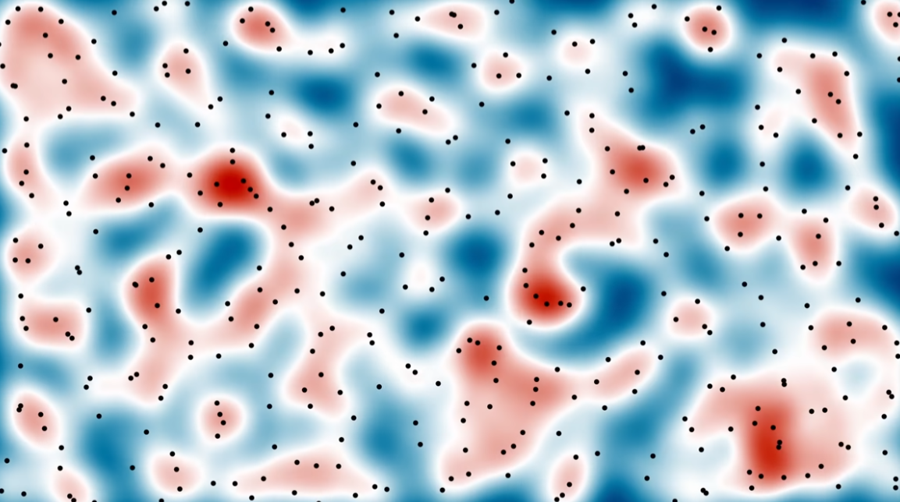
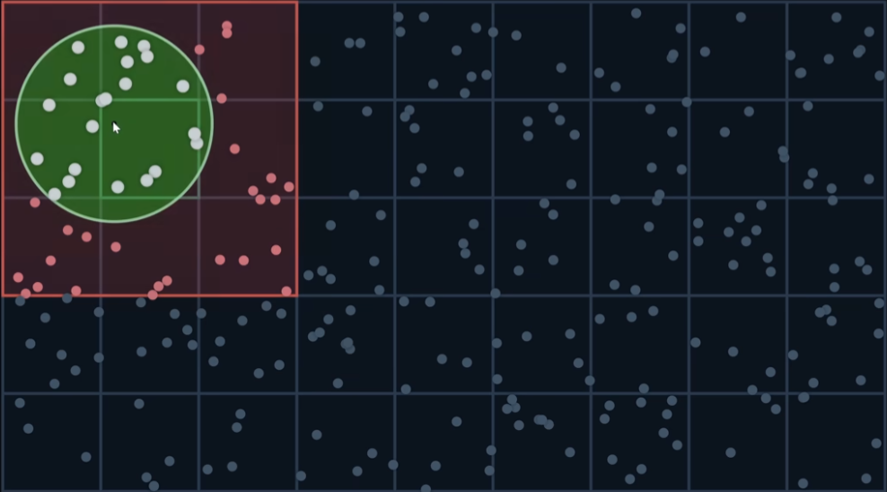
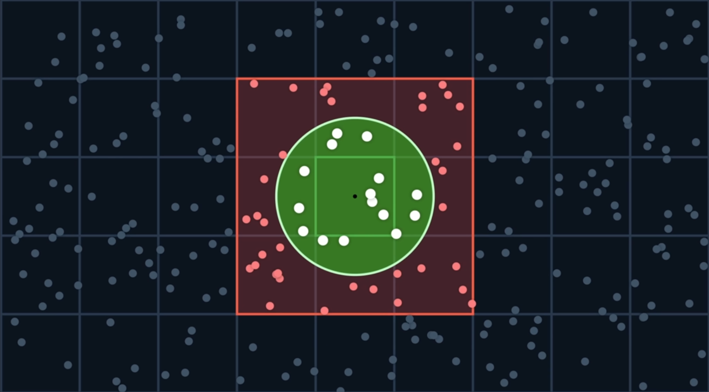
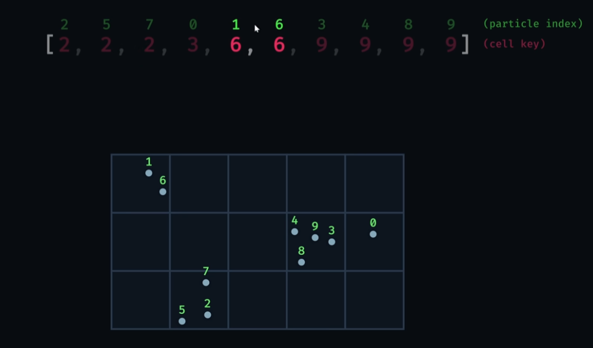
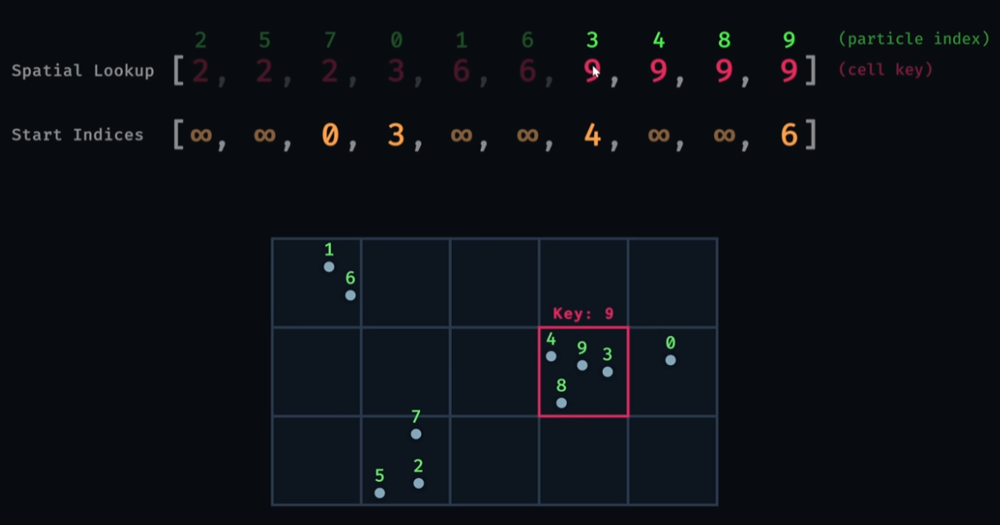
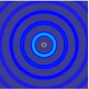
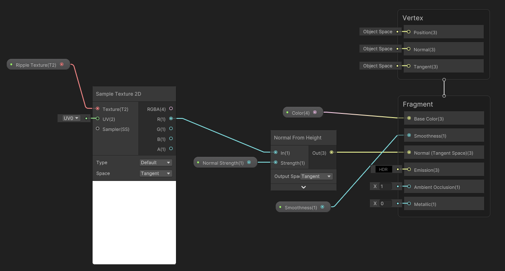
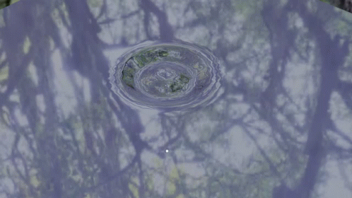

# Table of Contents
- [Project Overview](#project-overview)
- [Demo Video](#demo-video)
- [Background](#background)
- [Core Features](#core-features)
- [System Architecture](#system-architecture)
- [Fluid Simulation](#fluid-simulation)
- [Optimisations](#optimisations)
- [Visual Effects](#visual-effects)
- [User Interface](#user-interface)
- [Known Limitations](#known-limitations)
- [Future Work](#future-work)
- [References](#references)

# Project Overview

This project is intended for the development of a virtual reality application for Tai Chi. This is a modular component of a broader system where it mimics the Chinese Lacquer Fan painting technique:

<!-- PUT SOME IMAGES OF CHINESE LACQUER FAN PAINTING AND REFERENCE THEM  -->

The intent of this program is to manipulate dynamic water surfaces and oil paint using intuitive VR hand tracking interactions, being optimised for usage on the Meta Quest 2. This project prioritises realistic fluid mechanics and high performance which can also be adjusted in user settings within the simulation.

# Demo Video

<video controls src="ParticleSystem.mp4"></video>

# Background
The code for the oil paint system has been sampled and modified from Sebastian Lague's 2D simulation of simulating fluids. This uses smoothed-particle hydrodynamics which represents fluids as discrete moving particles rather than a static grid. 

# Core Features

- **Dynamic water screen**
    - Water surface can be adjusted to user-prefered sizes
    - Oil paint additionally moves with screen adjustment
    - Colours for paint can be adjusted
    - Ripple effects

- **Colour selection**
    - Similar to Microsoft Paint's interface
    - Can choose the colour of the paintballs
    - Multiple interfaces for colour selection
    - Colour wheel, Slider menu and HexPad selection provided
    - Can adjust throughout the simulation 
    
- **Navigation bar**
    - Similar to Meta Headset navigation bar
    - Can access the settings of the simulation
    - Can pause the entire simulation
    - Can clear and reset the paint simulation

- **Settings bar**
    - Can adjust user preferences 
    Environment- Allows switching between different scenery/terrains (where developers can easily add more)
    - Brush width- Changes the width of the interaction radius which controls the stroke size for the simulation
    - Paintball density – Affects the number of particles spawned from the paintball in contact with the canvas
    - Fluidity – Adjusts the smoothing radius of the particles, affecting fluid detail level (higher values show more detail but need higher paintball particle density)
    - Paint speed – Changes the simulation speed so fluid appears faster or slower over time
    - Sensitivity – Changes how strongly particles react to local pressure, so higher values make particles  push apart more strongly in crowded areas and respond more dramatically to interaction
    - Screen size – Changes the dimensions of the simulation bounds and water surface

- **Ripple effects**
    - When interacting with the canvas, ripple effects are created for a 3D effect
    - Reduces computation needed for a full 3D simulation

- **Mesh**
    - For realism, a mesh is used to connect the shape of the particles to 

- **Paintball Logic**
    - Once a paintball is used on the water screen canvas, paintballs respawn in their original places of spawn
    - Paintballs respawn even when falling through the floor
    - Paintballs disappear properly
    - Paintballs respawn with the same colour assigned
    - Changes to paintball colour in colour selection is not permanent     

- **Accuracy of the paintballs hitting the water surface**
    - There is a panel in the bottom corner of the screen to show you your accuracy
    - When paintballs do not hit the intended target of the water screen, accuracy decreases, increasing when the intended target is hit

# System Architecture

# Fluid Simulation

To mimic the incompressibility of water, the system calculates local particle density to generate pressure forces that push them apart. This uses a smoothing kernel which moderates the influence of neighbouring particles.

# Optimisations

## Grid-Based Spatial Partitioning
The system runs in a compute shader on the GPU, which allows the particle simulation to be processed in parallel for better performance. This stores particle data in arrays and uses a hash-and-key lookup system to assign each particle to a spatial grid cell. Particles in the same cell are grouped so that the simulation only needs to search nearby cells when checking for neigbours instead of comparing all particles with every other particle. 

 

 

Even when partcles share a cell, they are also compared within the interaction distance, so particles too far are ignored.

# Visual Effects

### Mesh System
For added realism, we have added a mesh system since the particles alone do not look realistic for fluid simulation. This uses Delaunay triangulation to connect the particles and uses the side lengths to determine which triangles to exclude, creating realistic gaps in the fluid. The colours are then linearly interpolated to create a smooth blending of colour

## Ripple Effects
We model ripples using the continuous wave equation $\frac{\partial^2 u}{\partial t^2} = c^2 \nabla^2 u$, where $u(x, y, t)$ is the wave height at surface position $(x, y)$ and time $t$. Discretising space and time using a texel grid with dimensions $\Delta x = \Delta y = 1$, the 2D Laplacian becomes $\nabla^2 u \approx u_{i-1,j} + u_{i+1,j} + u_{i,j-1} + u_{i,j+1} - 4u_{i,j}$.

Approximating the second time derivative with $\Delta t = 1$ frame gives $\frac{\partial^2 u}{\partial t^2} = u_{t+1} - 2u_t + u_{t-1}$. We set $c^2\Delta t^2 = 0.5$ to satisfy the Courant-Friedrichs-Lewy condition, ensuring the wave stays stable. A damping factor $\alpha$ ensures the ripple loses energy as it propagates, the final equation we implement is:

$
u_{t+1} = \alpha ( \frac{u_{i-1,j} + u_{i+1,j} + u_{i,j-1} + u_{i,j+1}}{2} - u_{t-1} )$

### Implementation
For each texel, the shader samples five values: the four neighbouring texels from the current render texture, and the same texel from the previous render texture. The neighbouring texels correspond to the values: $ u_{i-1,j}, u_{i+1,j}, u_{i,j-1}, u_{i,j+1} $. And the same texel from the previous render texture $u_{t-1}$.
The image shows the resulting effect:

The dynamic water surface ripples are generated in "RippleShader.shader". For each frame:
- The shader reads the current and previous render textures and writes the propagated wave in a temporary render texture.
- The previous render texture becomes the current, the current is assigned temporary, and the temporary is assigned the freed old previous texture, rotating buffers.
- The current render texture is combined with object textures using the Add Shader, writing the result to the temporary render texture.
- The material’s ripple texture is set to the temporary render texture

The final step is dealing with lighting to make the wave appear 3D. Curvature of the waves determines the direction of reflected light. We must calculate surface normals. This calculation is done within a shadergraph:

Why we opt for a shader graph instead of code:​
- Easier for developer to view pipeline​
- Requires little HLSL experience​
- Future developers can make changes easily, easy access to parameters​

The final ripple effect with lighting is shown below:

# User interface

# Known Limitations

# Future work

# References

- Sebastian Lague. *Coding Adventure: Simulating Fluids*. YouTube, 7 October 2023. https://www.youtube.com/watch?v=rSKMYc1CQHE